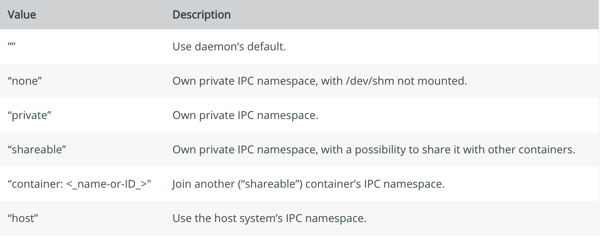
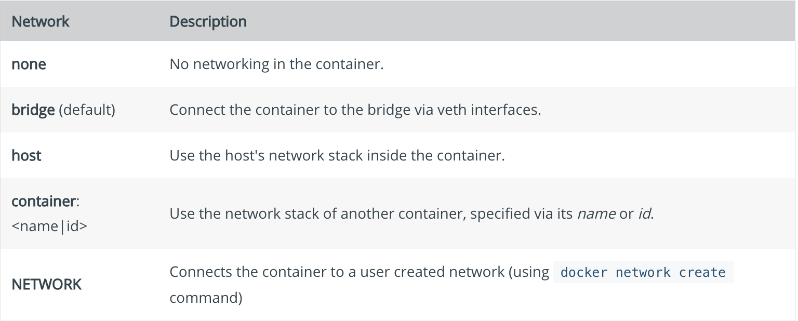

# docker run 

docker运行程序在一个分离的容器里面，容器是一个运行在宿主机上的进程，当执行`docker run`操作的时候，Docker运行的程序是独立的，因为它有自己的文件系统，自己的网络和自己的进程树。

## 标准格式

~~~bash
docker run [OPTIONS] IMAGE[:TAG|@DIGEST] [COMMAND] [ARG...]
~~~

`docker run`命令必须制定一个image来驱动容器。

## 分离的还是前台的

启动一个docker的时候你必须确定其是默认的前台进程还是后台进程

~~~bash
-d=false // 后台模式：在后台运行程序，并打印容器ID
~~~

此时只是在后台启动了一个容器，但是并没有进入这个容器，但是如果不添加-d参数，那么Docker在启动的时候默认以前台形式启动。

~~~
--rm //容器会被删除当它退出的时候
~~~

当以Foreground的形式启动的时候,有以下选项

~~~bash
-a=[]           : Attach to `STDIN`, `STDOUT` and/or `STDERR`
-t              : Allocate a pseudo-tty
--sig-proxy=true: Proxy all received signals to the process (non-TTY mode only)
-i              : Keep STDIN open even if not attached
~~~

-t -i 是必须的，这是为了分配一个tty给容器进程，但是容器从管道中接受标准输入的时候，-t 是禁止使用的。

## PID settings (--pid)

默认情况下，所有容器的PID namespace是开启的，namespace可以帮助实现进程的分离，同时隔绝了系统进程，并且所有的进程id都可以再次使用包括pid 1。

但是有时候会希望可以分享主机的namespace，进而可以查看主机和容器内的所有进程，当然，也可以加入其它容器的namespace进而实现容器间的进程共享。

~~~bash
--pid=host  ;共享主机进程
--pid=container:name ;共享容器进程
~~~

## UTS setting [--uts]

> UTS namespace可以实现uname()系统调用返回的量个系统描述符nodename和domainname的隔离，这两个值可以用`sethostname()`和`setdomainname()`系统调用来设置。

~~~bash
--uts=""  : Set the UTS namespace mode for the container,
       'host': use the host's UTS namespace inside the container
~~~

## IPC settings (--ipc)[🔗](https://docs.docker.com/engine/reference/run/#ipc-settings---ipc)

这个用来指定IPC namespce模式，IPC namespace提供进程间通信的隔离能力，使得不同namespace的进程无法通信。

当你不指定具体的模式的时候，默认条件下根据不同的daemon版本和配置会使用`private`和`shareable`两种模式的一种。

##  Runtime privilege

| Option         | Description                                                  |
| :------------- | :----------------------------------------------------------- |
| `--cap-add`    | Add Linux capabilities                                       |
| `--cap-drop`   | Drop Linux capabilities                                      |
| `--privileged` | Give extended privileges to this container                   |
| `--device=[]`  | Allows you to run devices inside the container without the --privileged flag. |

默认情况下docker container是`unprivileged`的，因为默认情况下container被禁止访问设备，但是`privileged`的container是具备和root用户一样的设备访问能力和权限的。

通过`--cap-add`参数，可以

## Network setting

默认情况下，所有的容器都开启了网络，可以对外进行连接，但是也可以在启动的时候对network进行设置

~~~bash
--dns=[]           : Set custom dns servers for the container
--network="bridge" : Connect a container to a network
                      'bridge': create a network stack on the default Docker bridge
                      'none': no networking
                      'container:<name|id>': reuse another container's network stack
                      'host': use the Docker host network stack
                      '<network-name>|<network-id>': connect to a user-defined network
--network-alias=[] : Add network-scoped alias for the container
--add-host=""      : Add a line to /etc/hosts (host:IP)
--mac-address=""   : Sets the container's Ethernet device's MAC address
--ip=""            : Sets the container's Ethernet device's IPv4 address
--ip6=""           : Sets the container's Ethernet device's IPv6 address
--link-local-ip=[] : Sets one or more container's Ethernet device's link local IPv4/IPv6 addresses
~~~

容器会使用和主机配置相同的DNS，除非你利用`--dns`选项进行设置。

同时，默认情况下，MAC地址使用分配给容器的IP地址生成，但是也可以使用`--mac-address`参数进行设置。

## 重要文件

容器中的可写层文件系统是位于 `/var/lib/docker/overlay/<mount-id>/merge` 目录下的，对这个目录下的文件进行修改可以直接影响运行中的容器的文件内容，在 `/var/lib/docker/overlay/<mount-id>/` 目录下还会有几个文件和目录，具体内容如下所示：diff 目录，这个目录用于存放当前层的镜像内容link文件，这个文件用于存放与之对应的短名称lower文件，这个文件用于存放记录父层的短名称work目录，这个目录用于联合挂载指定的工作目录mount-id的值是存储在 `/var/lib/docker/image/layerdb/mount/mount-id` ，可以根据这个值即可找到对应的容器的可写层在 `/var/lib/docker/containers/` 目录下存储的是有关于容器运行时的一些相关配置信息 

