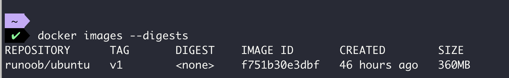
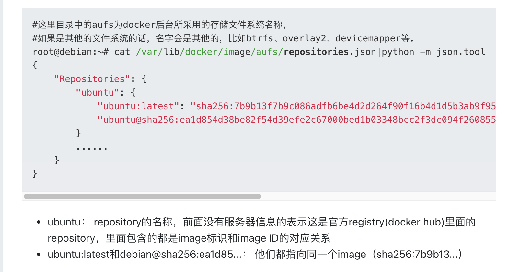

# docker如何在本地管理image?

> https://segmentfault.com/a/1190000009730986
>
> 这个算是对之前各个标准的使用吧，感觉卵用不大。没细看

docker 获得image的方式：

* docker pull
* docker build
* docker commit
* docker load
* docker import

等等

## 镜像相关的配置

Docker和image有关的目录`/var/lib/docker` 里面存放着image的所有信,这个路径可以修改

~~~bash
--graph, -g /var/lib/docker Root of the Docker runtime
~~~

## 镜像的引用方式

引用方式很多

docker hub上的官方镜像

- ubuntu： 官方提供的最新ubuntu镜像，对应的完整名称为docker.io/library/ubuntu:latest
- ubuntu:16.04： 官方提供的ubuntu 16.04镜像，对应的完整名称为docker.io/library/ubuntu:16.04
- ubuntu:@sha256:abcdef...： 官方提供的digest码为sha256:abcdef...的ubuntu镜像，对应的完整名称为docker.io/library/ubuntu@sha256:abcdef...

docker hub 上的非官方（个人）镜像

引用方式和官方镜像一样，唯一不同的是需要在镜像名称前面带上用户前缀，如：

- user1/ubuntu： 由user1提供的最新ubuntu镜像， 对应的完整名称为docker.io/user1/ubuntu:latest

user1/ubuntu:16.04 和 user1/ubuntu:@sha256:abcdef...这两种方式也是和上面一样，等同于docker.io/user1/ubuntu:16.04和docker.io/user1/ubuntu:@sha256:abcdef...

自己搭建的registry里面的镜像

- localhost:5000/ubuntu： 本地自己搭建的registry（localhost:5000）里面的官方ubuntu的最新镜像，对应的完整名称为localhost:5000/library/ubuntu:latest
- localhost:5000/user1/ubuntu@sha256:a123def...： 本地自己搭建的registry（localhost:5000）里面由用户user1提供的digest为sha256:a123def的ubuntu镜像

#### 为什么需要镜像的digest？

对于某些image来说，可能在发布之后还会做一些更新，比如安全方面的，这时虽然镜像的内容变了，但镜像的名称和tag没有变，所以会造成前后两次通过同样的名称和tag从服务器得到不同的两个镜像的问题，于是docker引入了镜像的digest的概念，一个镜像的digest就是镜像的manifes文件的sha256码，当镜像的内容发生变化的时候，即镜像的layer发生变化，从而layer的sha256发生变化，而manifest里面包含了每一个layer的sha256，所以manifest的sha256也会发生变化，即镜像的digest发生变化，这样就保证了digest能唯一的对应一个镜像。

## docker pull的大概过程

取image的大概过程如下：

- docker发送image的名称+tag（或者digest）给registry服务器，服务器根据收到的image的名称+tag（或者digest），找到相应image的manifest，然后将manifest返回给docker
- docker得到manifest后，读取里面image配置文件的digest(sha256)，这个sha256码就是image的ID
- 根据ID在本地找有没有存在同样ID的image，有的话就不用继续下载了
- 如果没有，那么会给registry服务器发请求（里面包含配置文件的sha256和media type），拿到image的配置文件（Image Config）
- 根据配置文件中的diff_ids（每个diffid对应一个layer tar包的sha256，tar包相当于layer的原始格式），在本地找对应的layer是否存在
- 如果layer不存在，则根据manifest里面layer的sha256和media type去服务器拿相应的layer（相当去拿压缩格式的包）。
- 拿到后进行解压，并检查解压后tar包的sha256能否和配置文件（Image Config）中的diff_id对的上，对不上说明有问题，下载失败
- 根据docker所用的后台文件系统类型，解压tar包并放到指定的目录
- 等所有的layer都下载完成后，整个image下载完成，就可以使用了

## image本地存放位置

对于本地镜像，因为没有传到repository上面去，所以没有digest,因为镜像的manifest由registry生成。

## repositories.josn

repositories.json中记录了和本地image相关的repository信息，主要是name和image id的对应关系，当image从registry上被pull下来后，就会更新该文件：

## manifest文件作用

从前面介绍docker pull的过程中得知，docker是先得到manifest，然后根据manifest得到config文件和layer。

前面已经介绍了config文件和layer的存储位置，但唯独不见manifest，去哪了呢？

manifest里面包含的内容就是对config和layer的sha256 + media type描述，目的就是为了下载config和layer，等image下载完成后，manifest的使命就完成了，里面的信息对于image的本地管理来说没什么用，所以docker在本地没有单独的存储一份manifest文件与之对应。

