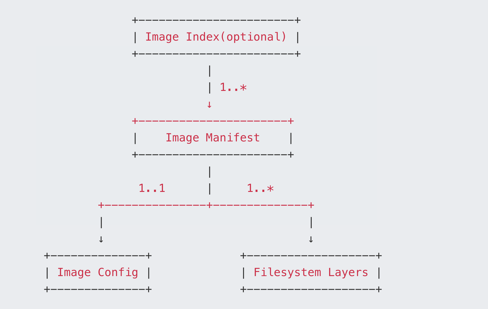

# image镜像是什么

> https://segmentfault.com/a/1190000009309347
>
> 文章整体讲解了OCI标准和image包内容，一下是一些复制笔记。

## 内容

一个image由[manifest](https://github.com/opencontainers/image-spec/blob/master/manifest.md) , [image index](https://github.com/opencontainers/image-spec/blob/master/image-index.md)(可选) ， [filesystem layers](https://github.com/opencontainers/image-spec/blob/master/layer.md) 和 [configuration](https://github.com/opencontainers/image-spec/blob/master/config.md)四部分组成。

- mage Index和Manifest的关系是"1..*"，表示它们是一对多的关系
- Image Manifest和Config的关系是"1..1"，表示它们是一对一的关系
- Image Manifest和Filesystem Layers是一对多的关系

## Filesystem Layers

Filesystem Layer包含了文件系统的信息，即该image包含了那些文件/目录，以及它们的属性和数据。

包含的内容：

每个filesystem layer都包含了在上一个layer上的改动情况。主要包含三个方面：

- 变化类型：是增加、修改还是删除了文件
- 文件类型：每个变化发生在哪种文件类型上
- 文件属性：文件的修改时间、用户ID、组ID、RWX权限等

比如在某一层增加了一个文件，那么这一层所包含的内容就是增加的这个文件的数据以及它的属性，具体的细节请参考[标准文档](https://github.com/opencontainers/image-spec/blob/master/layer.md)。

## 打包方式

最终每一个layer都可以打包成一个文件，文件格式是tar 和 tar + gzip中的一种。标准为此文件格式定义了两种新的`media types`

* application/vnd.oci.image.layer.v1.tar
* application/vnd.oci.image.layer.v1.tar+gzip

同时标准还定义了application/vnd.oci.image.layer.nondistributable.v1.tar和application/vnd.oci.image.layer.nondistributable.v1.tar+gzip这两种对应于nondistributable的格式，其实这两种格式和前两种格式包含的内容是一样的，只是用不同的类型名称来区分它们的用途，对于名称中有nondistributable的layer，**标准要求这种类型的layer不能上传，只能下载**。

## Image Config

image config是一个json文件，它的media type是`application/vnd.oci.image.config.v1+json`，这个json文件包含了对这个image的描述。

## manifest

[manifest](https://github.com/opencontainers/image-spec/blob/master/manifest.md)也是一个json文件，media type为`application/vnd.oci.image.manifest.v1+json`，这个文件包含了对前面filesystem layers和image config的描述，一看官方网站给出的示例就明白了：

manifest文件中config的sha256就是image的ID，即上面image config文件的sha256值

- config里面包含了对image config文件的描述，有media type，文件大小，以及sha256码
- layers包含了对每一个layer的描述，和对config文件的描述一样，也包含了media type，文件大小，以及sha256码

这里layer的sha256和image config文件中的diff_ids有可能不一样，比如这里的layer文件格式是tar+gzip，那么这里的sha256就是tar+gzip包的sha256码，而diff_ids是tar+gzip解压后tar文件的sha256码

## image index(可选)

[image index](https://github.com/opencontainers/image-spec/blob/master/image-index.md)也是个json文件，media type是`application/vnd.oci.image.index.v1+json`。

index文件存在的原因是为了让这个image支持多个平台和多个tag，到manifest为止其实已经有个整个image的完整描述，但是却不能提供多平台支持。

index文件包含了对所有manifest文件的描述，相当于一个manifest列表，包括每一个manifest的media type ， 文件大小，sha256码，支持的平台以及平台特殊的配置。

比如ubuntu想让它的image支持amd64和arm64平台，于是它在两个平台上都编译好相应的包，然后将两个平台的layer都放到这个image的filesystem layers里面，然后写两个config文件和两个manifest文件，再加上这样一个描述不同平台manifest的index文件，就可以让这个image支持两个平台了，两个平台的用户可以使用同样的命令得到自己平台想要的那些layer。

## image layout

> 到这里已经不属于image包含的内容

image从服务器上拉取下来之后，在本地应该怎么储存呢？OCI提供了相应的标准，名为[image layout](https://github.com/opencontainers/image-spec/blob/master/image-layout.md)，

> docker对OCI image layout的支持还在开发中，相关动态请关注：[Support OCI image layout in docker save/load](https://github.com/moby/moby/pull/26369)

但是我看目前最新版的docker，是以文件夹的方式进行分散存储的，但是应该也是用sha256进行索引寻找，不过我测试的本地镜像，没远程拉取，可能也是这个原因吧。

## oci-layout

包含image标准的版本信息

~~~json
dev@debian:~/images/hello-world$ cat ./oci-layout| jq .
{
  "imageLayoutVersion": "1.0.0"
}
~~~

## refs

里面的每一个文件就是一个tag，每个tag都是一个单独的image，相当于一个image的layout包里面可以包含多个有关系的image

## blobs

里面包含了具体文件的内容，每个文件名都是其内容的sha256码，根据上面refs文件里面的sha256，就能在这里找到对应的manifest文件的内容，然后根据manifest文件的内容，就能一步一步的往下找到image config文件和filesystem layers文件。

# 下载image

为了快速的构建container的rootfs，docker在本地有它自己的一套image管理方式，有自己的layout，并且目前`docker save`命令也不支持导出OCI格式的image，只能导出docker自己的格式，所以我们只能借助其它的工具得到OCI格式的image。